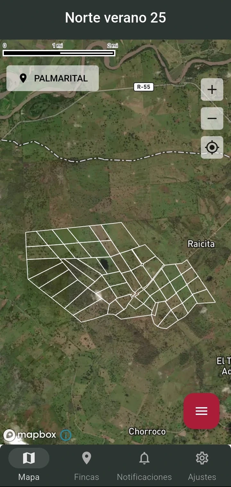

## Table of Contents
1. [Overview](#overview)
2. [Role](#role)
3. [Problem](#problem)
4. [Goal](#goal)
5. [Solution](#solution)
    - [Understanding User Needs](#understanding-user-needs)
    - [Core Features](#core-features)
    - [Design and Development Process](#design-and-development-process)
6. [User Testing](#user-testing)
7. [Challenges and Learnings](#challenges-and-learnings)
8. [Final Thoughts](#final-thoughts)

---

## Overview
**A4agroCultivos** is a modern app designed to help a farmers and agronomist track crop cycles, manage multiple farms and monitoring field conditions with precision all in offline available. Built using **Flutter**, **Firebase auth**, **Firestore**, and **BLoc**, the app provides a clean, intuitive interface to realize the digital transformation to the largest number of farmers.

---

## 👨‍💻 Role
**Senior Flutter Developer** and **Product owner**

---

## ❓ Problem
The accountant faced these challenges:
1. Delays in detecting and communicating field issues
Reports of pests, diseases, or weeds could take up to three weeks to reach decision-makers. Information moved very slowly through the chain of command, which resulted in equally delayed responses and significant production losses.
2. When reporting an issue, workers often relied only on the plot’s name. In farms with as many as 300 plots, this created confusion and errors, since it was very challenging for staff to remember each exact location.
3. Inefficient planning and lack of real-time visibility
Activity planning was usually done on whiteboards or paper, assuming everything would go as scheduled. However, plans had to be constantly rewritten and adjusted manually. As a result, management roles had no real-time visibility of activity progress, being forced to rely solely on verbal updates from the farm manager.

---

## 🎯 Goal
1. Develop a simple and intuitive mobile application that can be easily used by field workers with minimal training.
2. Capture geolocation points (GPS coordinates) for each field report to ensure precise identification of plots and issuess.
3. Provide full offline functionality, allowing users to register and access 100% of the information even without an internet connection.

---

## ✨ Solution  

### How do farmers and agronomists currently manage field operations?  
Through conversations with producers, managers, and agronomical engineers, we identified that:  
- Reports of pests, weeds, or diseases are often **shared verbally or on paper**, which causes delays.  
- **Plot identification is manual** (by name), creating confusion in farms with hundreds of plots.  
- **Activity planning is done on whiteboards or notebooks**, making it hard for managers to monitor progress in real time.  

### What features did users value most?  
After several feedback sessions with agronomists and producers, the following were identified as the most critical requirements:  
1. **Offline map access** to visualize farms and plots.  
2. **Geolocation tracking** to show the worker’s current position within the farm.  
3. **Multi-farm management** for producers who own multiple farms and create inside of the app becasue many farm plans are not digitized  
4. **Crop cycle organization** to group all activities and monitoring records by production cycle.  
5. **Two key modules:**  
   - **Activities:** to plan and track the sowing plan and scheduled tasks.  
   - **Monitoring:** to record and review field inspections.  

### Exploring new agricultural management tools  
We designed an app structure that combines:  
1. **Map-Centered Navigation:** Using **Mapbox** with offline support, enabling users to see their real-time location and the farm’s layout.  
2. **Producer & Farm Switching Menu:** A simple interface to change between producers and their respective farms.  
3. **Cycle-Based Information Flow:** Crop cycles can be selected in settings and are displayed as titles on the map for easy reference.  
4. **Task & Monitoring Modules:** Two main entry points that centralize sowing plans, activities, and monitoring reports.  

---

## 🚌 User Journey  

1. **Map Home Screen:**  
   - Central screen of the app, showing the producer’s farms and plots on an **interactive Mapbox map** (offline capable).  
   - Users can **highlight a plot** by tapping on it, and then view its details through an **ElevatedButton** that opens a **bottom sheet**.  
   - A **Floating Action Button (FAB) menu** allows quick actions:  
     - Switch between producers.  
     - Register a new activity (if a sublot is selected).  
     - Register a monitoring session.  

2. **Farm Screen:**  
   - Displays a **list of all farms** grouped by producer.  
   - Users can also **create a new farm** with an assisted **map view** to define its boundaries.  
   - A **FAB button** is available to add new farms easily.  

3. **Notifications Screen:**  
   - Displays **system and task notifications** (e.g., pending monitoring, overdue activities, sync status).  
   - Designed to keep both workers and managers informed in real time.  

4. **Settings Screen:**  
   - Allows users to configure the **active crop cycle** and view system preferences.  
   - Provides quick access to **producer management** and user profile options.  
---

## 🧪 User Testing
We tested the mobile app prototype with **10 agronomists and field workers** and gathered insights:  
- **Ease of Use:** 8/10 participants were able to register a monitoring session with minimal guidance.  
- **Map Interaction:** Users found it intuitive to tap on a plot to highlight it and access its details in the bottom sheet.  
- **FAB Menu:** The floating action button menu was appreciated for quick actions (switching producers, registering activities, or logging monitoring).  
- **Offline Access:** Users valued that all information remained accessible even without internet, especially in remote areas.  

---

## ⚙️ Challenges and Learnings
1. **Offline-First Design:** Ensuring the app worked seamlessly in areas without internet required leveraging **Firestore’s offline persistence and local cache** to keep all data available at 100%.  
2. **Map Performance:** Rendering large farms with hundreds of plots required optimization when using **Mapbox** to avoid performance issues on mid-range devices.  
3. **Usability for Non-Technical Users:** The app had to be extremely simple to use, with clear icons and minimal text, since some workers had little to no technical training.  

---

## ✨ Final Thoughts
1. **Offline-First is Essential:** By using **Firestore with offline caching**, the app provides reliability in rural areas where connectivity is limited.  
2. **Map as the Core Experience:** Building the app around an interactive offline map gave workers an intuitive way to locate and report field issues.  
3. **Modularity Adds Value:** Splitting the app into **Activities** and **Monitoring** modules provided clarity for both workers and managers.  
4. **Continuous Improvement:** Future iterations may include advanced analytics, push notifications for critical alerts, and integration with IoT sensors to further enhance decision-making.  

---

